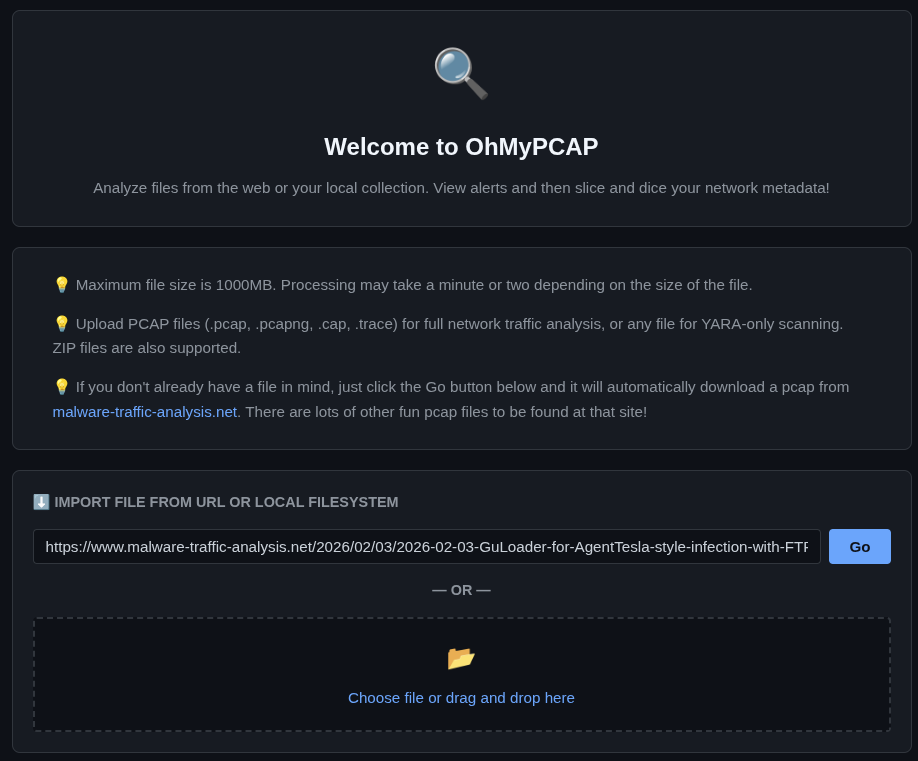
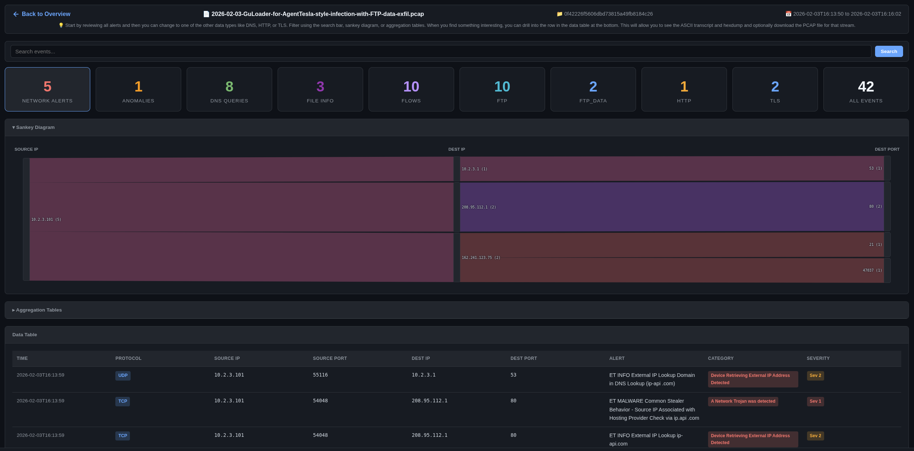

# OhMyPCAP

A standalone web application for analyzing PCAP files using Suricata. View security alerts, browse network metadata (DNS, HTTP, TLS, flows), extract ASCII transcripts, view per-packet hexdumps, and carve individual streams — all from a single-page UI.

## Screenshots

The welcome screen allows you to upload a PCAP file or load a previous analysis:



After analysis, you can view security alerts, network metadata, and extract streams:



## Table of Contents

- [Quick Demo](#quick-demo)
- [Quick Installation](#quick-installation)
  - [OhMyDebn](#ohmydebn)
  - [Docker](#docker)
    - [docker run](#docker-run)
    - [docker compose](#docker-compose)
    - [Air-Gapped / Offline Deployment for Docker](#air-gapped--offline-deployment-for-docker)
    - [Build Your Own Docker Image](#build-your-own-docker-image)
  - [Podman](#podman)
    - [podman run](#podman-run)
    - [podman compose](#podman-compose)
    - [Air-Gapped / Offline Deployment for Podman](#air-gapped--offline-deployment-for-podman)
    - [Build Your Own Podman Image](#build-your-own-podman-image)
- [Manual Installation](#manual-installation)
  - [Environment Variables](#environment-variables)
- [Usage](#usage)
  - [Analyze a PCAP](#analyze-a-pcap)
  - [Navigate Results](#navigate-results)
  - [Stream Analysis](#stream-analysis)
- [Data Storage](#data-storage)
- [Configuration](#configuration)
- [Security](#security)
- [Development](#development)
- [Testing](#testing)
- [License](#license)

## Quick Demo

The fastest way to try OhMyPCAP is with our online demo:

https://securityonion.net/pcap

Please note the following:
- this is a cloud-based service so please do not share any sensitive PCAP files or any other sensitive info
- free accounts are limited to 60 minutes of usage before the instance is automatically terminated
- if you need a private or permanent instance of OhMyPCAP, then you can proceed to the next section to perform a local installation of OhMyPCAP

## Quick Installation

For a private or permanent instance of OhMyPCAP, most folks will want to use our pre-built container image. We publish a container image that is compatible with both Docker and Podman. If you prefer not to use a pre-built image, then there are other options shown [below](#manual-installation).

### OhMyDebn

If you are running the latest version of [OhMyDebn](https://ohmydebn.org), then you can just press `Ctrl + Alt + P` to automatically install and run OhMyPCAP and then you can skip to the [Usage](#usage) section below.

### Docker

#### docker run

If you prefer `docker run`, then here are the steps you can use on Debian 13 or compatible distros:
```bash
# Install and configure docker.io
sudo apt update && sudo apt -y install docker.io && sudo usermod -aG docker $USER
# Create data directory
mkdir -p ~/ohmypcap-data
# Start OhMyPCAP
newgrp docker -c "docker run -v ~/ohmypcap-data:/data -p 8000:8000 ghcr.io/dougburks/ohmypcap:main"
```

#### docker compose

If you prefer to use `docker compose`, then here are the steps you can use on Debian 13 or compatible distros:
```bash
# Install and configure docker.io and docker-compose
sudo apt update && sudo apt -y install docker.io docker-compose && sudo usermod -aG docker $USER
# Download docker-compose.yml
wget https://raw.githubusercontent.com/dougburks/ohmypcap/refs/heads/main/docker-compose.yml
# Create data directory
mkdir -p ohmypcap-data
# Start OhMyPCAP (add the -d option to run in the background if desired)
newgrp docker -c "docker compose up"
```

To stop:
```bash
docker compose down
```

To restart:
```bash
docker compose restart
```

#### Air-Gapped / Offline Deployment for Docker

Our container image bakes in the Emerging Threats Open ruleset at build time, so it works without internet access. To copy to an isolated network, pull and save the container image using an internet-connected machine:

```bash
docker pull ghcr.io/dougburks/ohmypcap:main
docker save ghcr.io/dougburks/ohmypcap:main > ohmypcap.tar
```

Then transfer ohmypcap.tar to the isolated network via USB or other media. On the air-gapped machine:
```bash
docker load < ohmypcap-airgap.tar
docker run -v ~/ohmypcap-data:/data -p 8000:8000 ghcr.io/dougburks/ohmypcap:main
```

#### Build Your Own Docker Image

If you prefer to build your own Docker image, you can clone this github repo and then build the image:

```bash
git clone https://github.com/dougburks/ohmypcap
cd ohmypcap
docker build -t ohmypcap .
mkdir -p ~/ohmypcap-data
docker run -v ~/ohmypcap-data:/data -p 8000:8000 ohmypcap
```

### Podman

#### podman run

If you prefer Podman (rootless, daemonless), then here are the steps you can use on Debian 13 or compatible distros:
```bash
# Install podman
sudo apt update && sudo apt -y install podman
# Create data directory
mkdir -p ~/ohmypcap-data
# Start OhMyPCAP
podman run --userns=keep-id --user $(id -u):$(id -g) \
  -v $HOME/ohmypcap-data:/data -p 8000:8000 \
  ghcr.io/dougburks/ohmypcap:main
```

No `usermod` or `newgrp` is needed since Podman runs rootless by default. Use `$HOME` instead of `~` for the volume mount to avoid path expansion issues. The `--userns=keep-id --user $(id -u):$(id -g)` flags ensure files written to `~/ohmypcap-data` are owned by your host user.

#### podman compose

If you prefer to use `podman compose`, then here are the steps you can use on Debian 13 or compatible distros:
```bash
# Install and configure podman and podman-compose
sudo apt update && sudo apt -y install podman podman-compose
# Download docker-compose.yml
wget https://raw.githubusercontent.com/dougburks/ohmypcap/refs/heads/main/docker-compose.yml
# Create data directory
mkdir -p ohmypcap-data
# Start OhMyPCAP (add the -d option to run in the background if desired)
podman compose up
```

To stop:
```bash
podman compose down
```

To restart:
```bash
podman compose restart
```

#### Air-Gapped / Offline Deployment for Podman

Our container image bakes in the Emerging Threats Open ruleset at build time, so it works without internet access. To copy to an isolated network, pull and save the container image using an internet-connected machine:

```bash
podman pull ghcr.io/dougburks/ohmypcap:main
podman save ghcr.io/dougburks/ohmypcap:main > ohmypcap.tar
```

Then transfer ohmypcap.tar to the isolated network via USB or other media. On the air-gapped machine:
```bash
podman load < ohmypcap.tar
podman run --userns=keep-id --user $(id -u):$(id -g) \
  -v $HOME/ohmypcap-data:/data -p 8000:8000 ghcr.io/dougburks/ohmypcap:main
```

#### Build Your Own Podman Image

If you prefer to build your own Podman image, you can clone this github repo and then build the image:

```bash
git clone https://github.com/dougburks/ohmypcap
cd ohmypcap
podman build -t ohmypcap .
mkdir -p ~/ohmypcap-data
podman run --userns=keep-id --user $(id -u):$(id -g) \
  -v $HOME/ohmypcap-data:/data -p 8000:8000 ohmypcap
```

OhMyPCAP will check for internet access, update its NIDS rules if online (or use the baked-in rules if offline), and then prompt you to open http://localhost:8000/ohmypcap.html in your browser.

To stop a `docker run` or `podman run` instance, just press Ctrl-C in the terminal window or close the terminal window altogether. For `docker compose` or `podman compose`, use `docker compose down` or `podman compose down`.

## Manual Installation

If you prefer to run without Docker or Podman, then you will need these prerequisites:

- **Python 3** (stdlib only — no pip packages required)
- **Suricata** — for PCAP analysis and rule-based alerting
- **suricata-update** — for downloading/updating Suricata rules (internet access required; the app will warn and continue without rules if offline)
- **tcpdump** — for stream carving (`/api/download-stream`) and hexdump extraction (`/api/hexdump-stream`)
- **tshark** — for ASCII transcript extraction (`/api/ascii-stream`)

Once you have the prerequisites, then you can clone this github repo and run the server:
```bash
python3 ohmypcap.py
```

Then open http://localhost:8000/ohmypcap.html in your browser.

### Environment Variables

| Variable | Default | Description |
|---|---|---|
| `DATA_DIR` | `~/ohmypcap-data` | Directory for analyzed PCAPs and Suricata config |
| `BIND_ADDRESS` | `127.0.0.1` | Address to bind the HTTP server to |
| `PORT` | `8000` | HTTP server port |

Environment variables override the hardcoded defaults at startup.

## Usage

Once you've connected to OhMyPCAP in your browser, here are some of the things you can do.

### Analyze a PCAP

1. **Upload a file** — click "Choose File" and select a `.pcap`, `.pcapng`, `.cap`, or `.trace` file (or a `.zip` containing one)
2. **Load from URL** — paste a URL to a PCAP file and press **Enter** (or click **Go**). Password-protected zips from `malware-traffic-analysis.net` are auto-decrypted using the date-based password format
3. **Reopen a previous analysis** — previously analyzed PCAPs are listed on the welcome screen
4. **Re-analyze a previous PCAP** — click the 🔄 button next to any previous PCAP to delete its analysis and re-run Suricata (rules are updated first if internet access is available)

### Navigate Results

After Suricata finishes processing, the UI displays:

- **Stats Grid** — clickable cards showing event counts by type (Alerts, DNS, HTTP, TLS, Flows, etc.)
- **Sankey Diagram** — expand the collapsible heading to visualize network flow relationships (Source IP → Dest IP → Dest Port)
- **Aggregation Tables** — frequency counts for each column; click a value to filter
- **Data Table** — sortable table with expandable detail rows showing full event JSON, ASCII transcripts, and hexdumps
- **Filtering** — apply filters by clicking aggregation values; filter chips show active filters; filters persist across all tabs and the Sankey diagram

### Stream Analysis

Click any row in a data table to expand it, then:
- **ASCII Transcript** — view decoded TCP/UDP payload as readable text
- **Hexdump** — view per-packet hex dumps with collapsible packet headers
- **Download PCAP** — carve that specific stream into a standalone `.pcap` file

## Data Storage

All analyzed PCAPs are stored in `~/ohmypcap-data/`. Each analysis gets a subdirectory named by its MD5 hash containing:

```
~/ohmypcap-data/
  suricata/
    suricata.yaml          # Copied from /etc/suricata/, rule path rewritten
    rules/
      suricata.rules       # Downloaded by suricata-update (online) or copied from baked-in image (offline/air-gapped)
    disable.conf
  <md5>/
    <original-filename>.pcap   # The uploaded PCAP
    eve.json                   # Suricata's JSON output
    events.db                  # SQLite index (auto-created after analysis)
    name.txt                   # Human-readable display name
```

## Configuration

| Constant | Default | Description |
|---|---|---|
| `PORT` | `8000` | HTTP server port |
| `DATA_DIR` | `~/ohmypcap-data` | Root directory for analyzed PCAPs |
| `MAX_UPLOAD_SIZE` | `1000 MB` | Maximum PCAP upload size |
| `MAX_EVE_SIZE` | `1000 MB` | Maximum eve.json size |
| `MAX_TRANSCRIPT_SIZE` | `100,000 chars` | Maximum ASCII transcript / hexdump length |

Suricata config is auto-generated from `/etc/suricata/` on first run. Rules are downloaded via `suricata-update` when internet access is available; otherwise, the app uses baked-in rules (Docker/Podman) or warns and continues without rules (source).

## Security

- Binds to `127.0.0.1` only (no external access)
- No CORS wildcard
- Input validation on all endpoints (IP, port, MD5, path traversal)
- PCAP magic byte validation (rejects non-PCAP uploads)
- URL safety checks (blocks localhost, private IPs, resolves hostname)
- Zip-slip prevention on archive extraction
- Generic error messages (no internal details leaked)

## Development

See [docs/ARCHITECTURE.md](docs/ARCHITECTURE.md) for a detailed overview of how the pieces fit together.

See [docs/API.md](docs/API.md) for the full API reference.

See [docs/FILTERING.md](docs/FILTERING.md) for details on the filtering system.

See [docs/AGENTS.md](docs/AGENTS.md) for agent-focused guidance on maintaining OhMyPCAP, including updating vendored dependencies.

## Testing

```bash
# Server tests
python3 -m unittest tests.test_server -v

# UI tests
python3 -m unittest tests.test_ui -v

# All tests
python3 -m unittest discover -v
```

## License

See [LICENSE](LICENSE)
